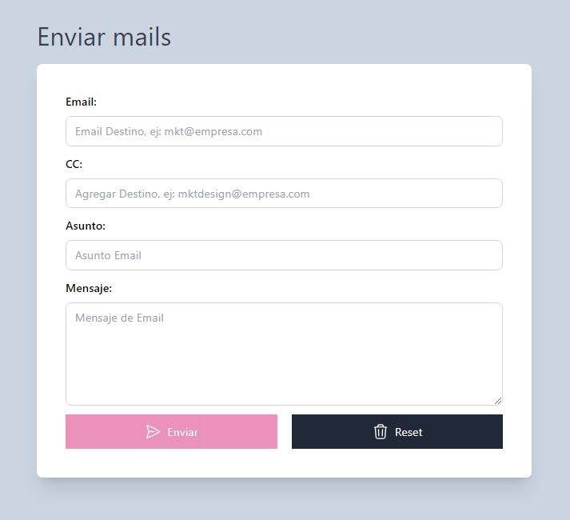

# Simulador de Envío de Correo Electrónico

Este es un sencillo simulador de envío de correo electrónico que te permite ingresar los detalles del correo y enviar un correo simulado. Incluye una validación básica del formulario y retroalimentación visual para la confirmación del envío exitoso.

## Tecnologías
- HTML
- Tailwind CSS
- JavaScript

## Características

- Validación de entrada para los campos de correo electrónico, cc (agregar otro destinatario), asunto y mensaje.
- Retroalimentación de validación en tiempo real a medida que escribes.
- El campo cc no es obligatorio a comparación de los demás.
- Desactiva el botón de enviar hasta que todos los campos obligatorios estén completos y tengan valores válidos.
- Simula el proceso de envío mostrando un indicador de carga durante un corto período.
- Limpia el formulario y muestra un mensaje de éxito después de enviar correctamente el correo.
- Permite reiniciar el formulario y eliminar cualquier mensaje de alerta.

## Uso

1. Clona el repositorio o descarga los archivos del código fuente.
2. Abre el archivo HTML (`index.html`) en un navegador web compatible con JavaScript.
3. Completa los campos del formulario con los detalles del correo electrónico: correo electrónico asunto, mensaje y cc(opcional).
4. A medida que ingreses los datos, recibirás retroalimentación en tiempo real sobre la validez de los campos.
5. Una vez que todos los campos obligatorios estén completos y tengan valores válidos, el botón de enviar estará activado y podrás hacer clic en él.
6. Todos los datos se guardan en un objeto llamado "email", podemos usar este objeto para enviar sus valores a otro lugar.
7. Verás un indicador de carga mientras se simula el envío del correo.
8. Después de un corto período, el indicador de carga desaparecerá y el formulario se reiniciará.
9. Se mostrará un mensaje de éxito en la parte superior del formulario para confirmar que el correo se ha enviado correctamente.
10. Si deseas restablecer el formulario en cualquier momento, puedes hacer clic en el botón de reset para eliminar los valores ingresados y las alertas.

  

